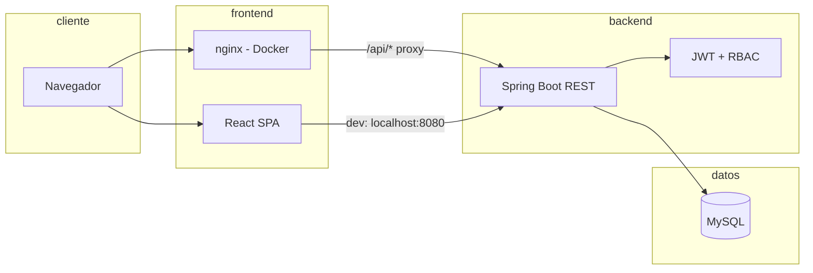
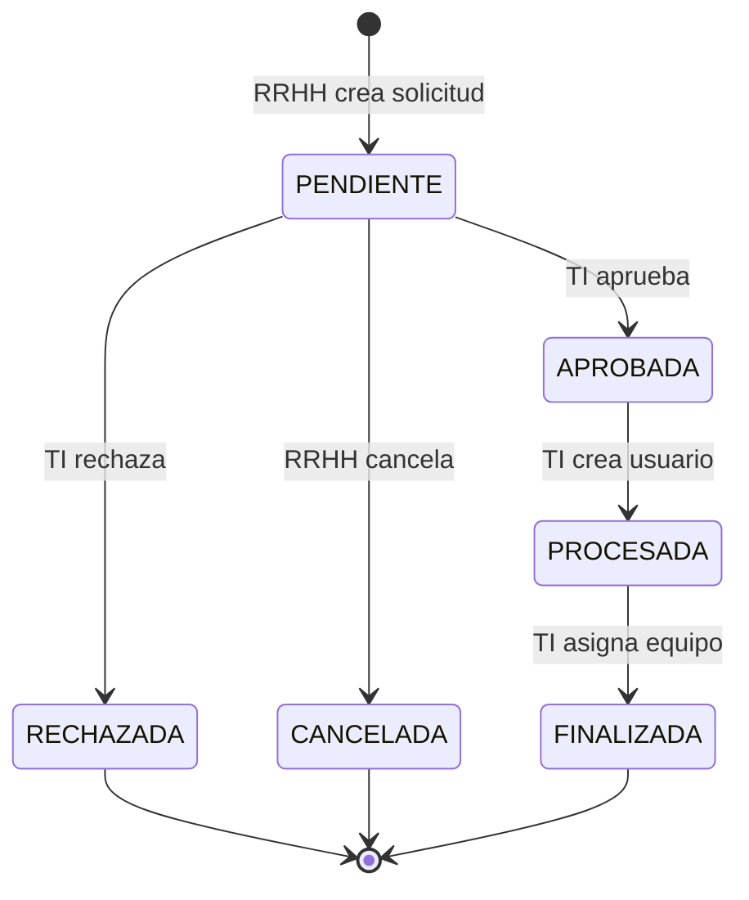

# Sistema Web Distribuido para la Gestión y Asignación de Equipos Tecnológicos

Aplicación web para gestionar el inventario de equipos TI, solicitudes de alta de colaboradores, creación de usuarios y asignación/devolución de equipos. El sistema separa responsabilidades entre **Recursos Humanos**, **TI** y **empleados**, con trazabilidad de cada cambio en el flujo de solicitudes.

## Stack tecnológico

| Capa | Tecnología |
|------|------------|
| Frontend | React 19, TypeScript, Vite, Material UI, React Hook Form, Yup, Axios |
| Backend | Java 21, Spring Boot 4.1, Spring Security, JWT, JPA/Hibernate |
| Base de datos | MySQL 8 |
| Despliegue | Docker Compose (MySQL + API + nginx) |

## Arquitectura



En **desarrollo local**, el frontend (`localhost:5173`) consume la API en `localhost:8080`.  
En **Docker**, nginx sirve el frontend y hace proxy de `/api` hacia el backend (mismo origen, sin problemas de CORS).

## Funcionalidades principales

- **Autenticación** con JWT y control de acceso por roles (RBAC).
- **Inventario de equipos**: alta, edición, baja lógica y restauración.
- **Usuarios**: creación directa (ADMIN/TI) sin pasar por solicitud.
- **Solicitudes de equipos**: flujo RRHH → aprobación TI → creación de usuario → asignación de equipo.
- **Asignaciones**: directas o vinculadas a solicitud; devolución de equipos.
- **Historial de solicitudes**: auditoría de cambios de estado.
- **Mis equipos**: vista del colaborador con sus asignaciones activas.
- **Dashboard (Home)**: resumen por rol con indicadores y accesos rápidos.

## Roles y permisos

| Rol | Descripción | Acceso principal |
|-----|-------------|------------------|
| **ADMIN** | Administrador del sistema | Todo lo de TI + gestión completa |
| **TI** | Soporte tecnológico | Equipos, usuarios, solicitudes, asignaciones, historial |
| **RRHH** | Recursos Humanos | Crear/cancelar solicitudes, ver historial, mis equipos |
| **EMPLEADO** | Colaborador final | Consultar equipos asignados |

| Módulo | ADMIN | TI | RRHH | EMPLEADO |
|--------|:-----:|:--:|:----:|:--------:|
| Home (dashboard) | ✅ | ✅ | ✅ | ✅ |
| Mis equipos | ✅ | ✅ | ✅ | ✅ |
| Solicitudes | ✅ | ✅ | ✅ | ❌ |
| Historial | ✅ | ✅ | ✅ | ❌ |
| Asignaciones | ✅ | ✅ | ❌ | ❌ |
| Usuarios | ✅ | ✅ | ❌ | ❌ |
| Inventario equipos | ✅ | ✅ | ❌ | ❌ |

> La autorización se aplica en el **backend** (Spring Security). El menú del frontend oculta opciones según el rol, pero la API es quien valida definitivamente cada operación.

## Flujo de negocio (solicitud de equipo)



**Alternativa:** TI puede crear usuarios y asignar equipos **directamente**, sin solicitud previa (módulos Usuarios y Asignación directa).

## Estructura del repositorio

```
Inventario-TI/
├── backend/          # API REST Spring Boot
├── frontend/         # SPA React + TypeScript
├── database/         # schema.sql y data.sql (MySQL)
├── docker-compose.yml
├── DOCKER.md         # Guía detallada de contenedores
└── README.md         # Este archivo
```

## Requisitos previos

### Opción A — Docker (recomendado para demo)

- [Docker Desktop](https://www.docker.com/products/docker-desktop/)
- Puertos libres: **80**, **8080**, **3306**

### Opción B — Desarrollo local

- Java 21
- Maven (incluido `mvnw` en `backend/`)
- Node.js 20+ y npm
- MySQL 8

## Inicio rápido con Docker

```bash
docker compose up --build
```

- **Aplicación:** http://localhost  
- **API (directa):** http://localhost:8080/api  
- **Login demo:** `admin` / `123456`

Para detener:

```bash
docker compose down
```

Más detalle (puertos, variables, problemas comunes): [DOCKER.md](./DOCKER.md)

## Desarrollo local (sin Docker)

### 1. Base de datos

Crea la base de datos ejecutando los scripts en orden:

```bash
mysql -u root -p < database/schema.sql
mysql -u root -p < database/data.sql
```

Por defecto el backend espera:

- Host: `localhost:3306`
- Base de datos: `inventario_ti`
- Usuario: `root`
- Contraseña: `admin`

(Ajusta en `backend/src/main/resources/application.properties` si usas otros valores.)

### 2. Backend

```bash
cd backend
# Linux / macOS
./mvnw spring-boot:run

# Windows
mvnw.cmd spring-boot:run
```

API disponible en http://localhost:8080/api

### 3. Frontend

```bash
cd frontend
npm install
npm run dev
```

Aplicación en http://localhost:5173 (consume la API en `http://localhost:8080/api`).

## Credenciales de prueba

| Usuario | Contraseña | Rol | Notas |
|---------|------------|-----|-------|
| `admin` | `123456` | ADMIN | Creado al arrancar el backend (`DataInitializer`) si no existe |

Los roles **TI**, **RRHH** y **EMPLEADO** existen en la base de datos; puedes crear usuarios con esos roles desde **Usuarios** (como ADMIN) o completando el flujo de solicitudes.

> La contraseña `123456` en usuarios creados desde solicitud es intencional para el entorno de demostración.

## Script de demostración (defensa)

Secuencia sugerida (~10 minutos):

1. **Login como ADMIN** → mostrar Home con KPIs y accesos rápidos.
2. **Inventario** → listar equipos disponibles; opcional: crear uno nuevo.
3. **Usuarios** → crear un usuario con rol EMPLEADO o RRHH.
4. **Logout** → entrar como **RRHH** → **Solicitudes** → crear solicitud de equipo para un colaborador.
5. **Logout** → entrar como **ADMIN/TI** → aprobar la solicitud.
6. **Crear usuario** desde la solicitud aprobada (contraseña inicial `123456`).
7. **Asignar equipo** disponible → solicitud pasa a `FINALIZADA`.
8. **Historial** → mostrar trazabilidad de cambios.
9. **Asignaciones** → devolver un equipo o hacer asignación directa.
10. **Login como EMPLEADO** → **Mis equipos** → ver asignación activa.
11. *(Opcional)* **Docker** → `docker compose up --build` y repetir login en http://localhost.

## Endpoints principales de la API

| Módulo | Base path | Descripción |
|--------|-----------|-------------|
| Auth | `/api/auth/login` | Autenticación JWT |
| Equipos | `/api/equipos` | CRUD inventario |
| Usuarios | `/api/usuarios` | CRUD usuarios |
| Solicitudes | `/api/solicitudes` | Flujo de solicitudes |
| Asignaciones | `/api/asignaciones` | Asignación, devolución, mis equipos |
| Historial | `/api/historial-solicitudes` | Auditoría de solicitudes |
| Catálogos | `/api/departamentos`, `/api/roles`, `/api/categorias` | Datos maestros |

Documentación por capa:

- [backend/README.md](./backend/README.md)
- [frontend/README.md](./frontend/README.md)

## Modelo de datos (resumen)

Entidades principales: **Usuario**, **Equipo**, **Solicitud**, **AsignacionEquipo**, **HistorialSolicitud**, más catálogos (**Rol**, **Departamento**, **CategoriaEquipo**).

Scripts completos: `database/schema.sql` y `database/data.sql`.

## Notas para evaluación

- **Sistema distribuido:** frontend, API y base de datos como servicios separados, comunicados por HTTP/REST.
- **Seguridad:** autenticación stateless (JWT), autorización por rol en backend.
- **Trazabilidad:** cada cambio relevante en solicitudes queda registrado en historial.
- **Despliegue reproducible:** Docker Compose empaqueta los tres servicios con un solo comando.

## Desarrollado por

Anthony Dávila
Kevin Jiménez
